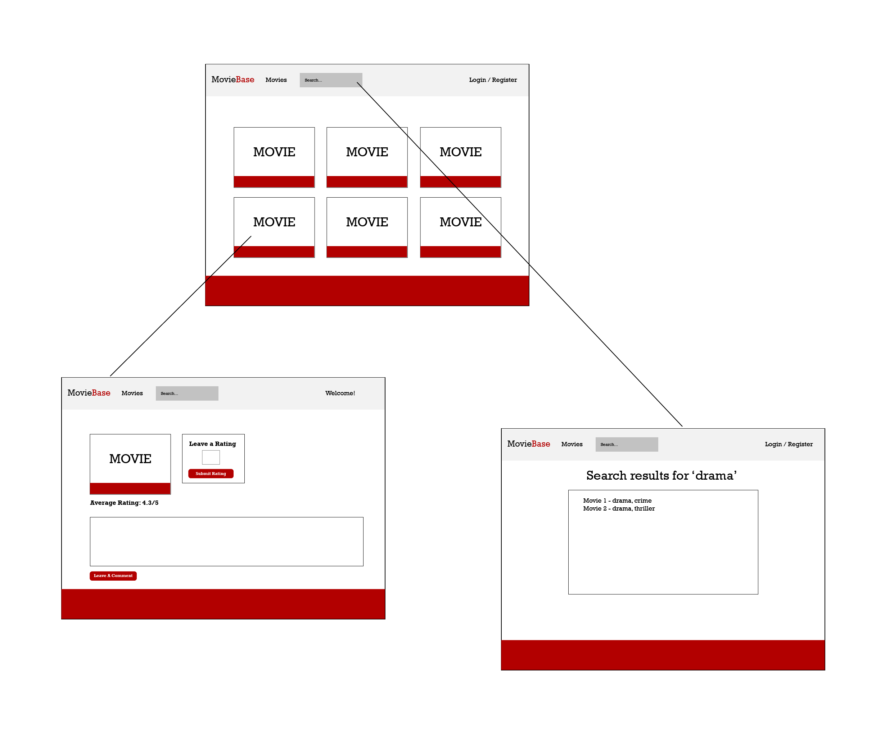
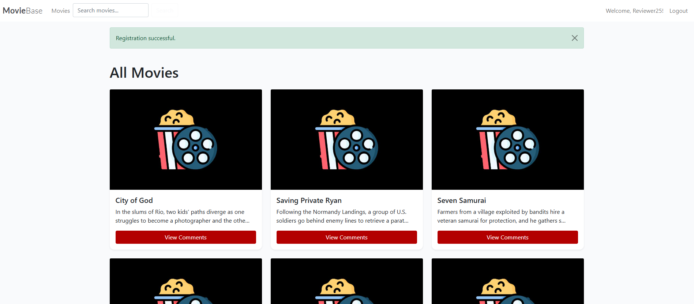
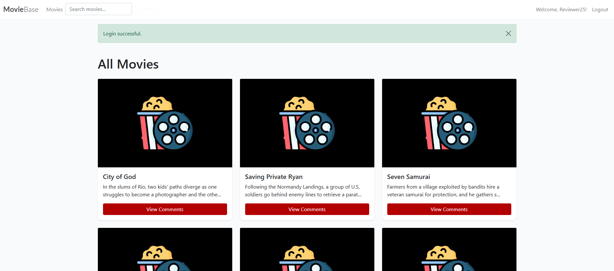
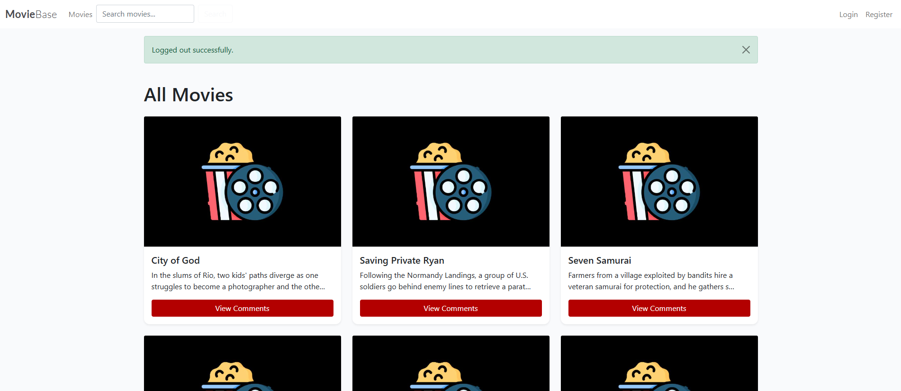
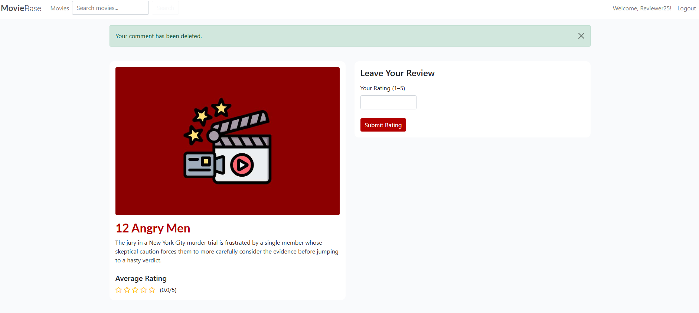
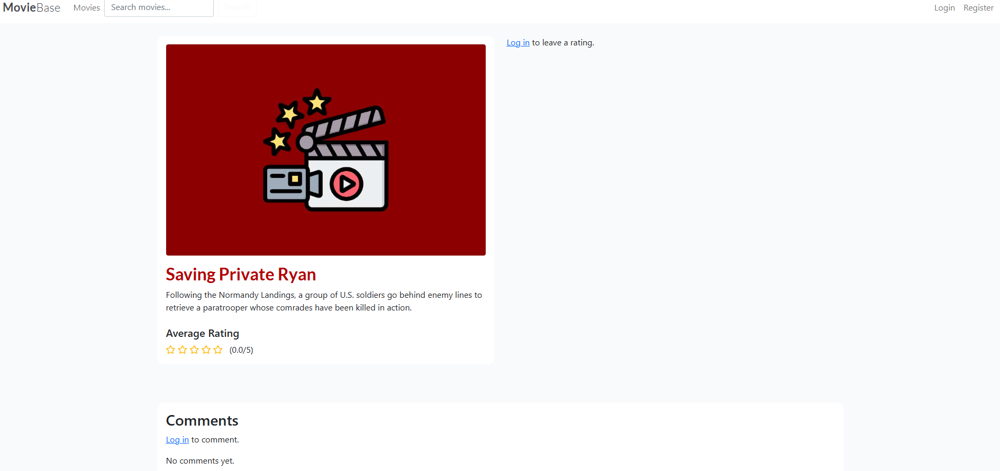
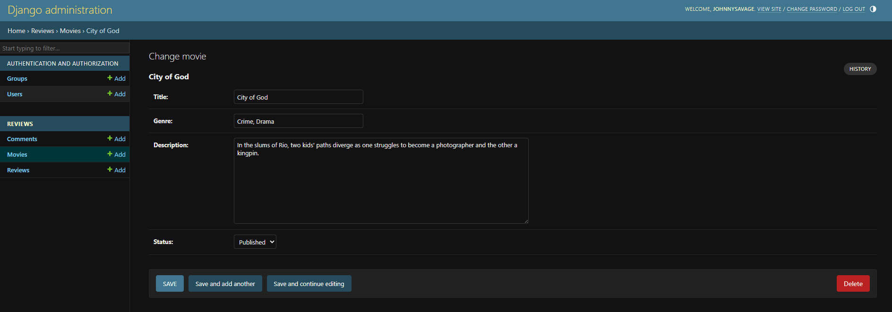
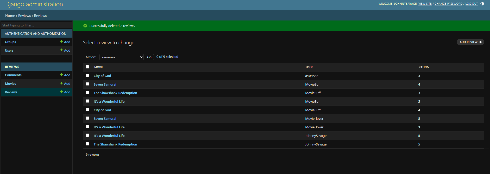

# MovieBase

MovieBase is designed for film enthusiasts who want to discover, review, and discuss movies. It serves as a community-driven platform where users can explore a curated list of movies, submit ratings, and leave comments. The platform is tailored for both casual viewers and dedicated movie critics who wish to engage in discussion, rate films, and share their opinions. The admin acts a curator who decides what type of movies will be added, they might want to focus on a niche subject within movies or have a theme depending on the time of year. For example, horror movies in October for Halloween, or festive movies in Decemeber for Christmas. The top 25 movies from [IMDB](https://www.imdb.com/chart/top/?ref_=nv_mv_250) have been added to show how it'll look when properly filled.

This site allows users to:

- Browse a selection of movies.
- Submit and edit reviews for films.
- Comment on movies and engage with other users.
- Register and log in to personalise their experience.

## Features

### Navigation Bar

- Persistent across all pages.
- Provides links to key sections: Movie List, Login/Register, and Logout.
- Fully responsive for seamless navigation across devices.

### Movie List/Home Page

- Displays a curated list of published movies.
- Each movie item links to a detail view.

### Movie Detail Page

- Shows full movie details: title, description, and average rating.
- Includes all user reviews and comments related to that movie.
- Authenticated users can add reviews and comments.

### Rating System

- Users can leave one rating per movie.
- Reviews are rated from 1 to 5 stars.

### Comment System

- Users can comment on each movie as many times as they like.
- Edit and delete options for comment authors.
- Modal popup confirmations for deletions.

### Authentication System

- Registration and login forms for user accounts.
- Secure user authentication and session handling.
- Login required for submitting reviews and comments.

### Responsive Design

- Optimised for mobile, tablet, and desktop screen sizes.
- Clean layout using Bootstrap 5 for consistent styling.

### Admin Panel

- Admin interface for managing movies, reviews, and comments.

### Search Page

- Search feature in navigation bar that can be used for searching keywords which can find movies based on title, genre and description.

### Footer

- Consistent footer across all pages.
- Has links to 4 social media websites.
- Also shows pagination for movie posts, 9 per page.

## Planning

Wireframes that were used to plan out the layout and flow between pages.

## Database Model Relationships

- Each Movie can have many Reviews and Comments.
- Each Review is written by one User and belongs to one Movie.
- Each Comment is written by one User and belongs to one Movie.

## Testing

All core features were tested manually and via automated Django tests.

### Manuel Testing
1. User Registration
    - Steps:

        1. Click register button in navigation bar.

        2. Enter a username, email, and password (password twice).

        3. Submit the form.

    - Expected Result: User account is created, a success message is displayed, and the user is redirected to the homepage.

    - Actual Result: Worked as expected
    

2. User Login & Logout
    - Steps:

        1. Click login in navigation bar.

        2. Enter valid credentials.

        3. Press "Login".

        4. Click "Logout".

    - Expected Result: User is logged in and redirected to the homepage. Logout link is visible when logged in. Logging out redirects to the homepage.

    - Actual Result: Worked as expected
    

    

3. Posting a Review
    - Steps:

        1. Log in.

        2. Go to a movie detail page.

        3. Fill in star rating.

        4. Submit the form.

    - Expected Result: Review appears on the page with correct rating and text.

    - Actual Result: Worked as expected
    

4. Posting a Comment
    - Steps:

        1. Log in.

        2. Go to a movie detail page.

        3. Scroll to comments section.

        4. Add a comment and submit.

    - Expected Result: Comment is displayed under the related review.

    - Actual Result: Worked as expected
    

5. Editing & Deleting Comments
    - Steps:

        1. Log in as the comment owner.

        2. Click "Edit" to modify a comment.

        3. Submit updated text.

        4. Click "Delete" to remove a comment and confirm in the modal.

    - Expected Result: Comment is updated or removed. Confirmation modal appears before deletion.

    - Actual Result: Worked as expected
    

    

6. Search Function
    - Steps:

        1. Use the search bar at the top of the page.

        2. Enter keywords from a movie title, genre, or description.

    - Expected Result: Search results page lists matching movies.

    - Actual Result: Worked as expected
    

7. Authentication Restrictions
    - Steps:

        1. Log out.

        2. Attempt to visit movie detail page and submit a review/comment.

        3. Click 'Log in' link either in review or comment section.

        4. Get redirected to log in page.

    - Expected Result: Redirected to the login page with a message requesting authentication.

    - Actual Result: Worked as expected
    

    
    
8. Admin Panel
    - Steps:

        1. Navigate to /admin/.

        2. Log in as a superuser.

        3. Manage movies, reviews, and comments.

    - Expected Result: Admin can view, add, edit, and delete records.

    - Actual Result: Worked as expected
    

    

    

### Django Tests
- 17 unit tests covering GET/POST [views](https://github.com/JohnnysavageNI/movie_review_project/blob/main/reviews/tests_views.py) and [form](https://github.com/JohnnysavageNI/movie_review_project/blob/main/reviews/test_forms.py) behavior.
- All tests passed successfully.

### JavaScript
- Modal functionality for editing and deleting comments manually tested.

### Validator Testing
- HTML: No errors using [W3C Validator](https://validator.w3.org/)
- CSS: No errors using [Jigsaw CSS Validator](https://jigsaw.w3.org/css-validator/)
- Python: All warnings in VS Code Problems panel resolved.

### Browser & Screen Compatibility
- Verified in Chrome and Edge.
- Display tested on widescreen monitor, laptop, tablet, and phone.

### Deployment

## The project is deployed to Heroku

Deployment Steps:

- Create a new Heroku app.
- Connect Heroku to GitHub repo.
- Set environment variables including DATABASE_URL and SECRET_KEY.
- Add required buildpacks (Python).
- Push code to Github.
- Run python manage.py migrate, createsuperuser, and collectstatic.

[Live Link](https://moviebase-reviewer-9b00ad1bd4d7.herokuapp.com/movies/)

### Credits

- Movie list and descriptions from [IMDB](https://www.imdb.com/chart/top/?ref_=nv_mv_250)
- Fonts from [Google Fonts](https://fonts.google.com/)
- Favicon from [RealFaviconGenerator](https://realfavicongenerator.net/)
- Graphics for project came from [Flat Icon](https://www.flaticon.com/)
- [Code Institute](https://codeinstitute.net/) project 'I Think Therefore I Blog' was used as a starting point, especially the navigation and footer layout.
- Stars for rating from [Font Awesome](https://fontawesome.com/) 
